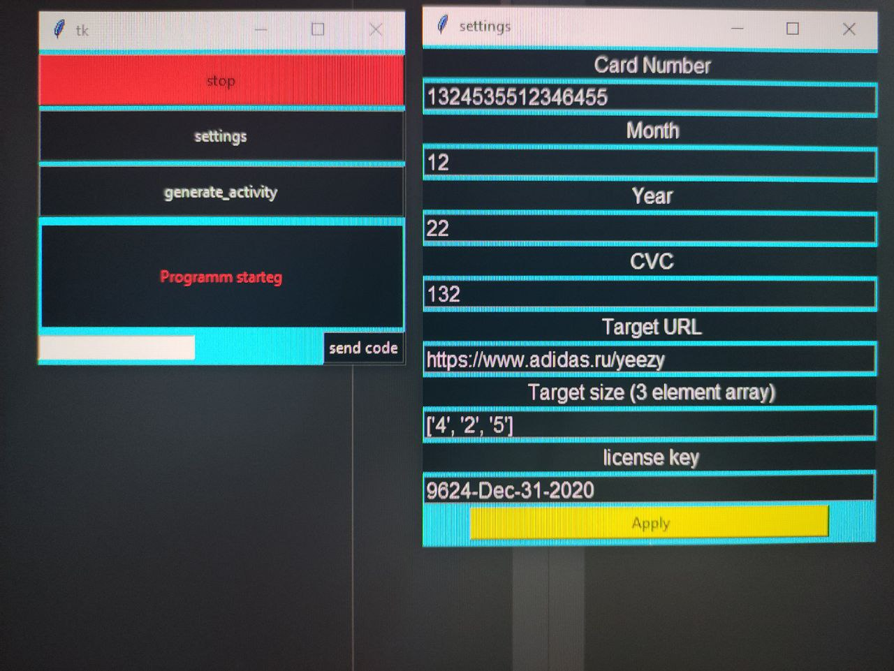

# Sneaker_bot

Bot to participate in the adidas sneaker raffle. It can use up to 1000 accounts in one raffle.
With this bot you can maximize your chances. 

Technology stack:
python 3.7, selenium. 

Also it required google crome and cromedriver.

To use this bot:
1. Use ganerate activity batton before raffle.
2. Input yor card info in settings.
3. Insert yor adidas accaunts to bot_accaunts.txt file.
4. Insert yor proxy to proxy_fot_bot.txt file.
5. Start bot after raffle starts.

